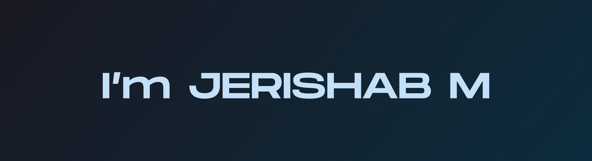

# 💫 About Me:
🎓 Computer Science Engineer  💻 Strong in C and Python with a focus on software development and problem-solving 🚀 Passionate about learning new technologies and building practical solutions ⚡ Eager to take on challenges and continually improve as a developer

- 📫 Reach me through : **jerishabmayan@gmail.com**

<h3 align="left">Connect with me:</h3>

# 💻 Tech Stack:
               
# 📊 GitHub Stats:
 
 

---

